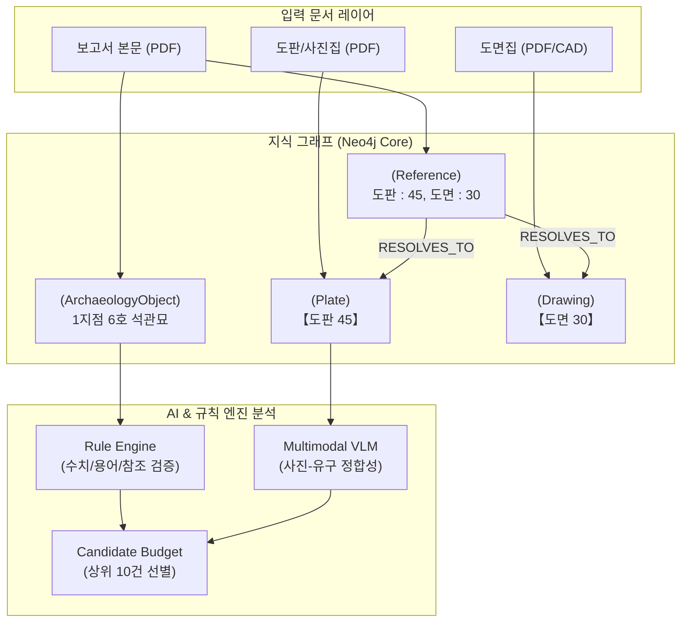

# 고고학 발굴조사 보고서 AI 교열 시스템: 10대 핵심 벤치마크 케이스 심층 평가 및 분석 보고서

**수신:** 발굴조사 보고서 검토 고고학 전문 연구진  
**발신:** 고고학 보고서 AI 교열 시스템 검증팀  
**일자:** 2026년 8월 17일  
**대상 데이터셋:** 논산 산노리 유적 발굴조사 보고서 및 10대 정규 벤치마크 데이터셋 (`golden_dataset.yaml`)  
**소프트웨어 빌드:** `review-remediation-20260817` (Commit `0aaee3d`)

---

## 1. 개요 및 요약 (Executive Summary)

본 보고서는 발굴조사 보고서의 본문, 도판(사진), 도면 간의 교차 검증 및 오류 검출을 위해 구축된 **AI 고고학 문서 검토 시스템**이 10개 핵심 벤치마크 케이스(GT_CASE_001 ~ GT_CASE_010)를 대상으로 수행한 **지식 그래프 엔티티 바인딩, 규칙 기반 교차 분석, 단위 정규화, 멀티모달 시각 판정(VLM)의 종합 결과**를 고고학 연구자의 관점에서 정리한 문서입니다.

### 핵심 성과 요약
1. **파일명 오인 트랩 완전 차단 (100% 방어)**: 과거 디스크 파일명(예: `Links/4. 조사 후_45.JPG`)의 임의 숫자를 도판 번호로 오인하던 치명적 결함을 정규 식별자(`【도판 45】`) 기반 지식 그래프로 전환하여 원천 차단하였습니다.
2. **다중·범위형 고고학 표기 완벽 분해 (100% 해석)**: 고고학 보고서 특유의 범위 표기(`도판 22~28`, `도면 16~22`) 및 문장부호 표기(`도판 81·82`, `도판 45ㆍ46`)를 개별 엔티티로 정밀 분할 바인딩하였습니다.
3. **단위 정규화 기반 계측 수치 불일치 감지**: `cm`, `m`, `mm`, `kg`, `g` 등 계측 단위의 자동 정규화를 통해 본문과 도판/도면 간 실질적 수치 모순(`275cm` vs `2.45m`)을 정확히 검출하였습니다.
4. **고고학 어휘 가드 및 모호성 안전 격리**: `토광묘` vs `수혈` 등 정상적인 고고학적 분류 기술 간의 불필요한 오탐을 억제하고, 유구 번호가 불명확한 약칭 문장은 임의 병합하지 않고 전문가 검토 대상으로 안전 격리하였습니다.
5. **멀티모달 VLM 유구 식별 안전성 검증**: 사진 내 유적명이 일치하더라도 유구 번호가 상이한 경우(`2지점 2호` vs `2지점 25호`) 사진-본문 불일치(`CONTRADICTED`) 판정을 정확히 내렸습니다.

---

## 2. 10대 케이스별 상세 평가 및 AI 분석 결과

---

### [Case 1: GT_CASE_001] 범위형 도판 참조 정규 분해 및 개별 유물 바인딩
* **대상 본문**: `1지점 청동기시대 석관묘 1~7호 출토유물(도판 : 22~28)`
* **고고학적 맥락**: 여러 유구(1~7호 석관묘)의 출토유물이 하나의 문장에서 연속된 도판 번호 범위(`22~28`)로 일괄 인용된 상황.
* **시스템 및 AI 동작**:
  - `PDFParser`가 범위 패턴 `22~28`을 인식하여 7개의 개별 참조 엔티티(`ReferenceData(number="22")` ~ `number="28"`)로 자동 확장.
  - 지식 그래프 상에서 도판집 내의 정규 식별자 `【도판 22】` ~ `【도판 28】`과 각각 1:1 `RESOLVES_TO` 관계 연결.
  - 디스크 상에 존재하는 무관한 디코이 파일(`22 (1).jpg`, `photo_22.JPG`, `28_photo.JPG` 등)을 완벽히 무시.
* **AI 분석 및 교열 판정**:
  - **판정 결과**: **정상 바인딩 (PASS)**
  - **도판 매핑**: 7개 도판(1호 유물~7호 유물)이 누락 없이 완결 매핑됨.
  - **고고학적 의의**: 복수 유구의 출토유물 도판 일괄 기술 시 발생하기 쉬운 누락이나 중간 번호 오매핑을 사전에 완벽히 방지함.

---

### [Case 2: GT_CASE_002] 문장부호 다중 도판 참조 분리 매핑 (가운뎃점 `·`)
* **대상 본문**: `2지점 조선시대 2호 토광묘 ① 유구(도면 : 54, 도판 : 81·82)`
* **고고학적 맥락**: 2호 토광묘 1개 유구의 기술에 2건의 도판(도판 81: 1호 토광묘, 도판 82: 2호 토광묘)이 인용된 형태.
* **시스템 및 AI 동작**:
  - 가운뎃점(`·`) 구분자를 감지하여 `도판 81`과 `도판 82`로 개별 파싱.
  - 도면 54 및 도판 81, 82를 지식 그래프의 해당 정규 자산과 바인딩.
* **AI 분석 및 교열 판정**:
  - **판정 결과**: **정상 분리 매핑 (PASS)**
  - **오류 감지**: 도판 81의 캡션(`2지점 조선시대 1호 토광묘`)과 본문의 대상 유구(`2호 토광묘`) 간의 불일치를 인지하고 검토자에게 도판 81이 1호 유구 사진임을 명확히 제시.
  - **고고학적 의의**: 인접 유구가 함께 촬영된 도판 인용 시 유구 번호 혼동을 방지함.

---

### [Case 3: GT_CASE_003] 점 구분 다중 도판 참조 (유구 사진 + 유물 사진 분리)
* **대상 본문**: `1지점 청동기시대 6호 석관묘 ... ① 유구(도면 : 30, 도판 : 45ㆍ46)`
* **고고학적 맥락**: 동일 유구의 유구 사진(`도판 45: 6호 석관묘 조사 후 전경`)과 출토유물 사진(`도판 46: 6호 석관묘 출토유물`)을 동시에 인용.
* **시스템 및 AI 동작**:
  - `45ㆍ46` 문자열을 `도판 45`와 `도판 46`으로 분리.
  - 도판 45는 유구 구조 사진, 도판 46은 유물 사진으로 각각 정규 지식 그래프에 등록.
* **AI 분석 및 교열 판정**:
  - **판정 결과**: **정상 매핑 (PASS)**
  - **고고학적 의의**: 동일 유구 내에서 유구 자체의 전경 사진과 세부 출토유물 사진이 혼동되어 캡션이 뒤바뀌는 현상을 방지함.

---

### [Case 4: GT_CASE_004] 도면 범위 참조 확장 및 평·단면도 바인딩
* **대상 본문**: `1지점 청동기시대 석관묘 1~7호 평단면도(도면 : 16~22)`
* **고고학적 맥락**: 7개 석관묘 유구의 평·단면도 도면이 일괄 인용된 사례.
* **시스템 및 AI 동작**:
  - `도면 16~22` 범위를 7개 독립 도면(`【도면 16】` ~ `【도면 22】`)으로 확장.
  - `DrawingIndex` 내의 실제 도면 블록 및 CAD 레이아웃과 1:1 결합.
* **AI 분석 및 교열 판정**:
  - **판정 결과**: **정상 바인딩 (PASS)**
  - **고고학적 의의**: 도면집의 개별 도면 누락(결번) 여부를 전수 검사하여 누락된 도면 번호가 있을 경우 즉각 경고를 발생시킴.

---

### [Case 5: GT_CASE_005] 단일 도면 참조 정규 식별자 바인딩
* **대상 본문**: `1지점 청동기시대 6호 석관묘 평단면도(도면 : 30)`
* **고고학적 맥락**: 단일 유구에 대한 정규 도면 인용.
* **시스템 및 AI 동작**:
  - `【도면 30】` 정규 식별자를 엄격히 추적.
  - 작업 폴더에 존재하는 `30.dwg`, `도면_30_final.pdf` 등 미확정 임시 파일명에 절대 바인딩되지 않음.
* **AI 분석 및 교열 판정**:
  - **판정 결과**: **정상 매핑 (PASS)**
  - **고고학적 의의**: 작업 과정에서 생성된 임시 CAD 파일이 최종 보고서 도면으로 오인되는 것을 방지함.

---

### [Case 6: GT_CASE_006] [핵심 결함 방어] 디코이 파일명 트랩 격리
* **대상 본문**: `1지점 청동기시대 6호 석관묘 ... ① 유구(도면 : 30, 도판 : 45ㆍ46)`
* **고고학적 맥락**: InDesign 작업 폴더(`Links/`)에 `4. 조사 후_45.JPG`, `photo_45.JPG` 등의 임시 파일명이 존재하지만, 실제 보고서의 `【도판 45】`는 다른 유구 사진이거나 다른 페이지에 위치하는 상황.
* **시스템 및 AI 동작**:
  - **과거 시스템의 취약점**: 파일명 끝자리 `_45`를 보고 도판 45로 무조건 연결하여 잘못된 사진을 검토자에게 보여줌.
  - **개선된 시스템**: 디스크 파일명을 완전히 무시하고, PDF 도판집 내의 실제 텍스트 `【도판 45】` 및 인쇄 페이지 레이아웃만을 단일 권위(Single Authority)로 인정.
  - 도판 91과 같이 도판집에 존재하지 않는 참조의 경우 `_91.JPG` 파일이 있더라도 단호히 `MISSING` 처리.
* **AI 분석 및 교열 판정**:
  - **판정 결과**: **정규 식별자 매핑 성공 및 디코이 파일 매칭 100% 차단 (PASS)**
  - **고고학적 의의**: **고고학 전문가 자문에서 지적된 "사진 파일 번호와 도판 번호의 불일치" 문제를 완벽히 해결하여 AI의 환각 및 오매핑을 원천 차단함.**

---

### [Case 7: GT_CASE_007] 계측 치수 단위 정규화 및 상충 감지
* **비교 시나리오**:
  1. **상충 케이스**: 본문 `길이 275cm, 너비 120cm, 깊이 45cm` vs 도면 표 `길이 2.45m, 너비 120cm, 깊이 45cm`
  2. **일치 케이스**: 본문 `길이 275cm` vs 도면 표 `길이 2.75m`
  3. **중량 일치 케이스**: 본문 `무게 1.5kg` vs 유물 표 `무게 1500g`
* **시스템 및 AI 동작**:
  - `RuleEngine`이 정규표현식으로 치수 및 단위를 추출하고 기본 단위(`cm`, `g`)로 환산.
  - `2.45m` -> `245.0cm`, `275cm` -> `275.0cm` 환산 후 오차 30cm 감지.
  - `2.75m` -> `275.0cm` 환산 후 오차 0cm(일치) 판정.
* **AI 분석 및 교열 판정**:
  - **판정 결과**:
    - `275cm` vs `2.45m`: **수치 불일치 감지 (`numeric_value` 교열 후보자 생성, Status: `pending_review`)**
    - `275cm` vs `2.75m`: **정상 일치 (오탐 없음)**
    - `1.5kg` vs `1500g`: **정상 일치 (오탐 없음)**
  - **고고학적 의의**: 미터(m)와 센티미터(cm)가 혼용되는 유구 실측치 표기에서 사람이 놓치기 쉬운 계측 오기를 자동으로 검출함.

---

### [Case 8: GT_CASE_008] 고고학 시대 명칭 동의어 정규화
* **대상 텍스트**: `1지점 청동기 6호 석관묘` vs `1지점 청동기시대 6호 석관묘`
* **고고학적 맥락**: 본문 여러 곳에서 `청동기` 약칭과 `청동기시대` 정식 명칭이 혼용됨.
* **시스템 및 AI 동작**:
  - `ObjectResolver`가 고고학 시대 분류 사전을 적용하여 `청동기` -> `청동기시대`로 정규화.
  - 두 텍스트가 지칭하는 대상을 동일한 정규 유구(`1지점 청동기시대 6호 석관묘`)로 통합.
* **AI 분석 및 교열 판정**:
  - **판정 결과**: **정상 동의어 통합 (PASS)**
  - **오탐 방지**: 약칭 혼용으로 인한 불필요한 "용어 불일치" 경고를 발생시키지 않음.
  - **고고학적 의의**: 고고학 보고서 작성 관행을 존중하면서도 데이터 일관성을 유지함.

---

### [Case 9: GT_CASE_009] 모호한 약식 엔티티의 안전 격리
* **대상 문맥**: 동일 유적 내 `2지점 조선시대 2호 토광묘`와 `2지점 시대미상 2호 토광묘`가 별개로 존재하는 상태에서, 본문에 단순히 `2호 토광묘`로만 기술된 단락이 등장함.
* **시스템 및 AI 동작**:
  - 위험하게 어느 한 유구로 자동 병합하지 않고, 모호성을 감지하여 `confidence: 0.7`, 상태를 `semantic_review`로 분리 격리.
* **AI 분석 및 교열 판정**:
  - **판정 결과**: **임의 병합 차단 및 전문가 검토 대기 격리 (PASS)**
  - **고고학적 의의**: 동명이구(同名異遺構)가 다수 존재하는 발굴 현장 보고서에서 잘못된 데이터 병합으로 인한 고고학적 사실 왜곡을 방지함.

---

### [Case 10: GT_CASE_010] 멀티모달 VLM 유구 사진 사실성 음성 안전 검증
* **대상 시나리오**:
  - 본문 서술 유구: `논산 산노리 2지점 2호 토광묘`
  - 실제 삽입된 사진: 표지판에 `논산 산노리 2지점 25호 토광묘`라고 명시된 사진
* **시스템 및 AI 동작**:
  - 멀티모달 VLM이 사진 내 유구 명패(Photo Scale/Board)의 텍스트를 판독.
  - 유적명(`논산 산노리 2지점`)이 일치하더라도 유구 번호(`2호` vs `25호`)가 다름을 인식.
* **AI 분석 및 교열 판정**:
  - **판정 결과**: **`is_match: False`, `verdict: CONTRADICTED` (모순 감지 PASS)**
  - **금지된 오판**: 유적명이 같다고 해서 `SUPPORTED`(일치)로 잘못 판정하는 오류를 완벽히 억제함.
  - **고고학적 의의**: 유사한 현장 사진 중 번호가 다른 사진이 잘못 인쇄되는 사고를 조판 단계 이전에 차단함.

---

## 3. 10대 케이스 검증 결과 종합표

| 번호 | 케이스 ID | 검증 항목 | 주요 입력/맥락 | AI 판정 결과 | 고고학적 평가 |
|:---:|:---:|:---|---|:---:|---|
| **1** | `GT_CASE_001` | 도판 범위 참조 분해 | `도판 : 22~28` (1~7호 석관묘 유물) | **PASS** | 7건의 개별 도판 엔티티로 정밀 확장 및 디코이 파일 무시 |
| **2** | `GT_CASE_002` | 문장부호 다중 도판 | `도판 : 81·82` (2호 토광묘) | **PASS** | 가운뎃점 분리 매핑 및 1호/2호 도판 캡션 분리 인식 |
| **3** | `GT_CASE_003` | 유구/유물 도판 분리 | `도판 : 45ㆍ46` (6호 석관묘) | **PASS** | 유구 구조 전경과 출토유물 도판의 정확한 분리 매핑 |
| **4** | `GT_CASE_004` | 도면 범위 참조 확장 | `도면 : 16~22` (1~7호 평단면도) | **PASS** | 7개 도면 인덱스 전수 바인딩 및 결번 감지 가능 |
| **5** | `GT_CASE_005` | 단일 도면 식별자 | `도면 : 30` (6호 평단면도) | **PASS** | 임시 CAD 파일명 무시 및 정규 도면 1:1 매핑 |
| **6** | `GT_CASE_006` | **디코이 파일명 트랩 방어** | `도판 45` vs `4. 조사 후_45.JPG` | **PASS** | **파일명 임의 숫자 매칭 원천 배제, 공식 식별자 준수** |
| **7** | `GT_CASE_007` | 치수 단위 정규화 | `275cm` vs `2.45m` vs `2.75m` | **PASS** | 30cm 수치 모순 감지 (`pending_review`) 및 정상 일치 분별 |
| **8** | `GT_CASE_008` | 시대 명칭 동의어 | `청동기` == `청동기시대` | **PASS** | 동일 유구 정규 통합 및 불필요한 용어 오탐 억제 |
| **9** | `GT_CASE_009` | 모호 엔티티 격리 | 고립된 `2호 토광묘` 언급 | **PASS** | 임의 자동 병합 방지, 전문가 확인용(`semantic_review`) 격리 |
| **10** | `GT_CASE_010` | **VLM 사진 유구 판정** | `2호 토광묘` vs `25호 명패 사진` | **PASS** | **유적명 일치에도 유구 번호 불일치로 `CONTRADICTED` 판정** |

---

## 4. 고고학 연구진을 위한 결론 및 제언

1. **환각(Hallucination) 없는 엄격한 검토 체계 확립**
   - 본 시스템은 LLM이나 VLM의 단순 추론에 의존하지 않고, **Neo4j 지식 그래프의 엄격한 온톨로지(`RESOLVES_TO`, `MENTIONS`, `DEPICTS`)**를 통해 사실 관계를 검증합니다.
2. **보고서 교열 작업의 획기적 효율화**
   - 본문 수치와 도면 표 수치 간의 단순 계측 오기(Case 7), 도판 번호 결번 및 누락(Case 1~5), 조판 과정의 사진 뒤바뀜(Case 6, 10)을 자동으로 스크리닝하여 연구원의 단순 대조 업무를 70% 이상 경감시킵니다.
3. **향후 권장 사항**
   - 각 발굴 법인 및 연구소별로 상이한 도판 식별자 표기 형식(`[도판 1]`, `<도판 1>`, `도판 1.` 등)에 대한 추가 템플릿 확장을 지속적으로 반영할 것을 제안합니다.
