# [명세 및 작업 가이드] 고고학 AI 교열 시스템 4대 핵심 개선 과제 핸드오프 문서

**문서 번호:** `SPEC-20260818-ARCH-01`  
**작성일:** 2026-08-18  
**대상 구현자:** 프론트엔드 / 백엔드 / 그래프 파이프라인 전담 에이전트  
**브랜치:** `review-remediation-20260818-strict-run-contract` 또는 신규 작업 브랜치  
**관련 이슈:**
1. 프론트엔드 UI 가시성 버그 (버튼/프로젝트 목록 흰색 배경-마우스오버 결함)
2. 원천 포맷(`.ai`, `.indd`, `src/` 폴더) 입력 지원 및 실물 파일 구조 파이프라인
3. 고고학자 친화적 지식 그래프 시각화 (ID 위주 출력 탈피 및 도메인 의미 파싱)
4. 프로젝트 시간 정보(`createdAt`/`updatedAt`) 추가 및 최신순(내림차순) 정렬

---

## 1. 개요 (Overview)

본 문서는 발굴조사 보고서 AI 교열 시스템의 현장 실사용성과 고고학 전문가 검토 품질을 제고하기 위해 발견된 4가지 핵심 문제점의 원인을 정밀 분석하고, 다른 에이전트가 즉각적이고 정확하게 수정 작업을 진행할 수 있도록 작성된 상세 기술 명세서입니다.

---

## 2. 과제별 상세 문제점 분석 및 구현 명세

```mermaid
graph TD
    subgraph "과제 1: UI/CSS 가시성 개선"
        A1["흰색 배경/투명 텍스트 버그"] --> A2["styles.css 버튼/목록 토큰 통일"]
        A2 --> A3["항상 가시적 UI 표시 (Hover 제거)"]
    end

    subgraph "과제 2: 원천 src 포맷 지원"
        B1["src/ 환경 도면 (*.ai)"] --> B3["도면 인덱스 & 래스터 캐시 파이프라인"]
        B2["src/ 도판 Links (*.jpg)"] --> B3
        B3 --> B4["InDesign (.indd) 레이아웃 매핑"]
    end

    subgraph "과제 3: 그래프 정보 도메인 파싱"
        C1["난해한 UUID/내부 ID 노출"] --> C2["고고학적 명칭/관계 텍스트 파싱"]
        C2 --> C3["[인용: 도판 45] -> [해결: 6호 석관묘 전경]"]
    end

    subgraph "과제 4: 프로젝트 시간정보 & 최신순 정렬"
        D1["Project 모델에 createdAt 누락"] --> D2["Neo4j p.createdAt 타임스탬프 부여"]
        D2 --> D3["ORDER BY p.createdAt DESC 정렬 & UI 표기"]
    end
```



---

### 📌 과제 1. 프론트엔드 UI 가시성 버그 수정 (항상 가시적 표시)

#### 1.1 현재 문제점 분석
- **현상**:
  - `ProjectsPage.tsx`의 "진행 중인 검수 프로젝트" 목록 아이템, "목록 새로고침" 버튼(`secondary-button`), 그리고 `ProjectDetailPage.tsx`의 일부 검수 작업 버튼들이 **기본 상태에서 흰색 배경에 흰색 글자(또는 연한 배경에 투명)**로 렌더링되어 텍스트가 보이지 않음.
  - 마우스를 올렸을 때(`:hover`)만 배경색/글자색이 변경되면서 글자가 나타남.
  - 고고학자가 처음 화면에 진입했을 때 빈 영역으로 오인하거나 클릭할 버튼을 찾지 못하는 심각한 UX 결함 발생.
- **원인 코드**:
  - `ProjectsPage.tsx`에서 사용 중인 `className="secondary-button"`이 `styles.css`에 정의되어 있지 않아 기본 스타일 상속 오류 발생.
  - `styles.css`의 버튼 기본 스타일(`color: #ffffff; background: #275443;`)과 각 패널 컴포넌트의 인라인 `background: #ffffff` 스타일이 충돌.
  - `project-structure.css`의 `structure-tree-row` 등은 상시 가시성이 보장되어 있으나, 기존 페이지의 버튼 및 카드 컴포넌트에는 hover-only 스타일 또는 투명 배경이 적용되어 있음.

#### 1.2 구현 요구사항
1. **`secondary-button` 및 범용 버튼 CSS 토큰 정의 (`frontend/src/styles.css`)**:
   ```css
   .secondary-button {
     display: inline-flex;
     align-items: center;
     justify-content: center;
     padding: 8px 14px;
     border: 1px solid #cbd5e1;
     border-radius: 6px;
     background: #ffffff;
     color: #1e293b; /* 항상 짙은 글자색 유지 */
     font-weight: 600;
     font-size: 0.88rem;
     cursor: pointer;
     transition: background-color 0.15s ease, border-color 0.15s ease;
   }
   .secondary-button:hover {
     background: #f1f5f9;
     border-color: #94a3b8;
     color: #0f172a;
   }
   ```
2. **프로젝트 목록 카드 상시 시인성 확보 (`frontend/src/pages/ProjectsPage.tsx`)**:
   - 인라인 스타일 대신 `.project-card-item` CSS 클래스를 적용하고, 제목(`#183328`), 내부 코드(`#64748b`), 화살표 아이콘(`#275443`)이 **hover 여부와 무관하게 항상 선명하게 표시**되도록 수정.
   - 마우스 hover 시에는 부드러운 그림자(`box-shadow`) 및 테두리 강조(`border-color: #275443`)만 동작하도록 개선.
3. **새로고침 및 액션 버튼 가시성 보장**:
   - 새로고침 버튼에 명시적인 아이콘(`🔄`)과 짙은 텍스트를 부여하여 항시 인지 가능하도록 구성.

---

### 📌 과제 2. 원천 포맷(`.ai`, `.indd`) 및 `src/` 실제 파일 구조 입력 파이프라인 구축

#### 2.1 실제 발굴조사 데이터 디렉터리 (`src/`) 구조 명세
실제 발굴조사 현장 및 보고서 제작 환경의 파일 구조는 다음과 같습니다:

```text
src/
├── 본문 및 부록 (글)/
│   ├── 산노리 본문.hwp                  # 발굴보고서 한글 본문 원본
│   ├── 고찰, 맺음말.hwp
│   ├── 부록1. 구석기시대 자연분석 결과보고서.hwp
│   └── 부록2. 방사성탄소연대측정 결과보고서.pdf
│
├── 환경 도면/                            # 도면 원천 벡터 파일 (*.ai)
│   ├── 도면1. 위치도(15-22)5만.ai
│   ├── 도면16. 구석기시대발굴조사지역 출토유물.ai
│   ├── 도면17. 1지점-유구현황도(15-22)800.ai
│   ├── 도면20. 2지점-유구현황도(15-22)600.ai
│   ├── 도면30. 1지점 6호 석관묘 평단면도.ai
│   ├── 삽도1. 위성지도(15-10)만도.ai
│   └── 삽도6. 4지점 트렌치 동벽 토층.jpg
│
└── 도판(사진들)/                         # 도판 원천 고해상도 사진 및 인디자인
    ├── 산노리_도판.indd                  # Adobe InDesign 조판 원본 (또는 PDF 내보내기)
    └── Links/                           # InDesign 링크 실물 사진 파일들
        ├── 22 (1).jpg                   # 도판 22-1 출토유물 사진
        ├── 22 (2).jpg                   # 도판 22-2 출토유물 사진
        ├── 4. 조사 후_45.JPG             # 도판 45 원천 현장 사진
        ├── 4. 조사 후_81.JPG             # 도판 81 원천 현장 사진
        └── 3. 토층_85.JPG               # 도판 85 토층 단면 사진
```

#### 2.2 현재 문제점 분석
- 시스템이 입력 파일로 오직 `PDF` 확장자만 강제하고 있어, 실무 연구원이 보유한 `.ai`(Illustrator 도면) 및 `Links/` 폴더 내 원천 사진 파일들을 직접 업로드하거나 폴더 단위로 인제스트할 수 없음.

#### 2.3 구현 요구사항
1. **도면 벡터 파일(`.ai`) 인제스트 지원 (`backend/app/services/drawing_parser.py` & `ingest.py`)**:
   - `*.ai` 파일명에서 도면 번호 및 유구명 자동 추출 (예: `도면17. 1지점-유구현황도(15-22)800.ai` -> `DrawingData(number="17", title="1지점-유구현황도", uri="...")`).
   - `.ai` 파일은 PDF 호환 스트림(Acrobat Compatibility)이 내장되어 있으므로 PyMuPDF(`fitz.open()`)로 래스터 렌더링을 추출하거나, 썸네일 캐시를 생성하는 로직 추가.
2. **`src/` 디렉터리 일괄 임포트 CLI/API 스크립트 제공 (`scripts/ingest_src_folder.py`)**:
   - `src/` 경로를 입력받아:
     - `src/본문 및 부록 (글)/` -> `report_body` DocumentVersion 생성
     - `src/환경 도면/` -> `drawing_book` DocumentVersion 및 `Drawing` 노드 일괄 등록
     - `src/도판(사진들)/` -> `plate_book` DocumentVersion 및 `Links/` 내 사진들을 `Plate`/`PlatePanel` 지식 그래프로 자동 바인딩.
3. **InDesign(`*.indd`) 대응**:
   - `.indd`는 바이너리 레이아웃 파일이므로, 내보낸 `도판.pdf`와 `Links/` 폴더를 페어링하여 인제스트하는 안내 및 자동 번들 업로더 지원.

---

### 📌 과제 3. 고고학자 친화적 지식 그래프 시각화 및 노드/관계 텍스트 파싱

#### 3.1 현재 문제점 분석
- **현상**:
  - 지식 그래프 탐색기(`EvidenceGraphExplorer.tsx` 및 `ProjectStructureExplorer.tsx`)에서 노드 및 관계를 표시할 때 `cand_run_4eb4a11cc7a2_7ec06731f001`, `f1083e3c-9dab-4008-bfe4-b25d1a9f7b80_drawing_30`, `ref_051e...`와 같은 **시스템 내부 UUID/해시 ID**가 화면 전면에 노출됨.
  - 관계선(Edge) 역시 단순 영문 식별자(`RESOLVES_TO`, `MENTIONS`, `DEPICTS`, `HAS_BLOCK`)로만 표시되어, 고고학자가 "이 선이 어떤 본문과 어떤 도판 사진을 연결하고 있는지" 전혀 파악할 수 없음.

#### 3.2 구현 요구사항
1. **노드 타이틀 및 라벨 파싱 룰 전면 개선 (`frontend/src/components/EvidenceGraphExplorer.tsx`)**:
   - **ID 노출 완전 차단**: `id.slice(0, 14)`와 같은 임시 fallback을 금지하고, 의미 있는 텍스트가 없을 경우 `[미지정 유구]`, `[1지점 유구 캡션]` 등의 도메인 친화적 레이블 생성.
   - **노드별 표시 규격**:
     - `ArchaeologyObject`: `[유구] 1지점 6호 석관묘 (청동기시대)`
     - `Plate / PlatePanel`: `[도판 45] 1지점 6호 석관묘 조사 후 전경 (인쇄 54쪽)`
     - `Drawing / DrawingRegion`: `[도면 30] 1지점 6호 석관묘 평·단면도`
     - `Reference`: `[본문 인용] 도판 : 45 (1지점 6호 석관묘 단락)`
     - `TextBlock`: `[본문 단락] "1지점 6호 석관묘는 해발 44m 구릉 정상부에 조성..."`
     - `CorrectionCandidate`: `[교열 제안] 치수 불일치: 길이 275cm vs 2.45m (High)`
2. **관계선(Edge) 라벨 한글화 및 문맥 정보 첨부 (`frontend/src/components/EvidenceGraphExplorer.tsx`)**:
   | 내부 관계명 | 고고학자 친화적 표시 레이블 | 부가 툴팁 / 설명 문맥 |
   |---|---|---|
   | `[:RESOLVES_TO]` | **"인용 도판 연결"** | 본문의 `도판 : 45` 인용구가 실제 도판집 `【도판 45】` 사진으로 바인딩됨 |
   | `[:MENTIONS]` | **"유구 언급"** | 본문 단락에서 `1지점 6호 석관묘` 유구를 명시적으로 서술함 |
   | `[:DEPICTS]` | **"유구 실물 묘사"** | 도판 사진(패널)이 `1지점 6호 석관묘`의 실체 구조를 촬영한 것임 |
   | `[:ABOUT]` | **"대상 유구"** | 교열 후보자가 지적하는 오류의 대상 유구 |
   | `[:HAS_PANEL]` | **"세부 사진 포함"** | 도판 페이지 내에 분할된 ①~⑤ 세부 사진 패널 |
   | `[:HAS_REGION]` | **"도면 영역 포함"** | 도면 페이지 내에 평면도 / 단면도 개별 블록 |
3. **지식 그래프 인스펙터 상세 정보 카드 개선 (`ProjectStructureInspector.tsx`)**:
   - JSON 덤프 대신 `발굴 지점: 1지점`, `시대 구분: 청동기시대`, `유구 분류: 석관묘`, `수록 도판: 도판 45, 도판 46`, `수록 도면: 도면 30` 형태의 고고학적 메타데이터 표 형태로 렌더링.

---

### 📌 과제 4. 프로젝트 시간정보(`createdAt`/`updatedAt`) 추가 및 최신순 정렬

#### 4.1 현재 문제점 분석
- **현상**:
  - `Project` 도메인 모델(`models.py`), 스키마(`schemas.py`), Neo4j 노드(`Project`)에 생성일시(`created_at`/`createdAt`) 및 수정일시(`updated_at`/`updatedAt`)가 없어 프로젝트 생성 시점을 알 수 없음.
  - 프로젝트 목록 API(`GET /api/v1/projects`)가 임의 순서(또는 ID 순)로 반환되어, 방금 생성한 최신 프로젝트가 목록 맨 아래에 위치하거나 찾기 어려움.

#### 4.2 구현 요구사항
1. **도메인 모델 및 스키마 업데이트**:
   - **`backend/app/domain/models.py`**:
     ```python
     @dataclass(frozen=True, slots=True)
     class Project:
         id: str
         name: str
         internal_code: str | None
         created_at: str | None = None
         updated_at: str | None = None
     ```
   - **`backend/app/api/schemas.py`**:
     ```python
     class ProjectResponse(ApiModel):
         id: str
         name: str
         internal_code: str | None = Field(default=None, alias="internalCode")
         created_at: str | None = Field(default=None, alias="createdAt")
         updated_at: str | None = Field(default=None, alias="updatedAt")
     ```
2. **Neo4j 레포지토리 수정 (`backend/app/graph/project_repository.py`)**:
   - **프로젝트 생성 시 (`create_project`)**:
     ```cypher
     CREATE (p:Project {
         id: $id,
         name: $name,
         internalCode: $internal_code,
         createdAt: datetime(),
         updatedAt: datetime()
     })
     ```
   - **프로젝트 목록 조회 시 (`list_projects`)**:
     ```cypher
     MATCH (p:Project)
     RETURN p.id AS id, p.name AS name, p.internalCode AS internal_code,
            toString(coalesce(p.createdAt, p.created_at)) AS created_at,
            toString(coalesce(p.updatedAt, p.updated_at)) AS updated_at
     ORDER BY coalesce(p.createdAt, p.created_at) DESC
     ```
3. **프론트엔드 목록 UI 업데이트 (`frontend/src/pages/ProjectsPage.tsx` & `frontend/src/api.ts`)**:
   - `Project` 인터페이스에 `createdAt?: string | null` 추가.
   - 프로젝트 카드에 생성일시 표기 (예: `생성일시: 2026-08-18 01:30`).
   - 기본 정렬을 `createdAt` 기준 최신순(내림차순)으로 보장.

---

## 3. 구현 검증 기준 (Acceptance Criteria)

1. **UI 가시성**:
   - [ ] 마우스 hover 없이도 모든 버튼, 프로젝트 목록 카드, 새로고침 버튼이 선명한 텍스트로 보일 것.
   - [ ] 흰색 배경에 흰색 글자가 나타나는 영역이 0건일 것.
2. **원천 파일 지원**:
   - [ ] `src/환경 도면/` 내의 `*.ai` 파일들을 도면집으로 인식하고 인덱스를 생성할 수 있을 것.
   - [ ] `src/도판(사진들)/Links/` 내의 실물 사진들이 누락 없이 도판 패널로 바인딩될 것.
3. **그래프 정보 파싱**:
   - [ ] 지식 그래프 노드 및 엣지에 난해한 UUID가 노출되지 않고, 한글 고고학 명칭(`[유구] 1지점 6호 석관묘`, `인용 도판 연결`)으로 렌더링될 것.
4. **프로젝트 시간정보 및 정렬**:
   - [ ] 신규 프로젝트 생성 시 `createdAt` ISO 타임스탬프가 저장될 것.
   - [ ] 프로젝트 목록이 항상 최신 생성순(내림차순)으로 정렬되어 첫 번째에 최신 프로젝트가 나타날 것.
